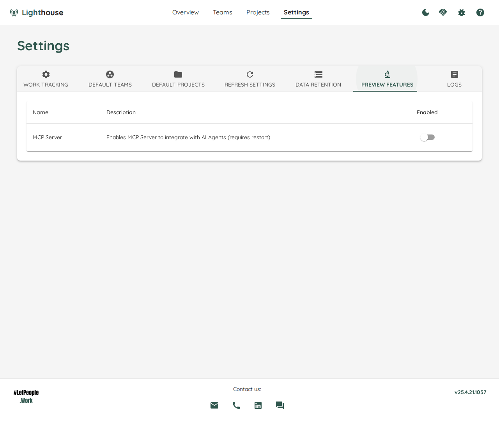

# Lighthouse v25.4.25.614
{: .d-inline-block }
Latest
{: .label .label-green }

## Allow to override rank field for Jira
In some occasions, it may be needed to define a specific _rank_ field in Jira. This is now possible via the config file. See [documentation](https://docs.lighthouse.letpeople.work/Installation/configuration.html#rank-field-override) for details.

## Fixed Bugs
- The calculation of the _Started_ and _Closed_ dates was not always correct when items moved between states that belonged to the same category. This is fixed now for both Azure DevOps and Jira
- There would be an error if you had a status with an _&_ in the name (like "Dev&Test"). Lighthouse can now handle such cases.

## Improvements
- The "Hide Completed Features" toggle is not resetting every time, but the state is remembered
- The dialog that shows the in-progress items is now handling long item names better (with a line break instead of expanding the width)
- Updated various third-party libraries
- 
[**Full Changelog**](https://github.com/LetPeopleWork/Lighthouse/compare/v25.4.21.945...v25.4.25.614)

## Contributions ❤️ 
Special Thanks to [Hendra Gunawan](https://www.linkedin.com/in/hendragunawan823/) and [Gonzalo Mendez](https://www.linkedin.com/in/gonzalo-mendez-nz/) for their contributions!

# Lighthouse v25.4.21.945

## New UI
We've spent some time in overhauling the UI, making it look more modern. It's also more responsive now, meaning you can get a decent look at Lighthouse from your mobile device.

Furthermore, we've added a toggle to switch between _Light_ and _Dark_ Mode.

## Flow Metrics for Teams and Projects
We've added support for basic Flow Metrics, both for Teams and Projects. You can now switch on the respective Detail pages between _Forecasts_ and _Metrics_.

The following Metrics are shown:
- Work Items In Progress (based on state configuration in settings)
- Features being worked on based on Work Items In Progress (Team only)
- Cycle Time Percentiles
- Throughput Run Chart
- Cycle Time Scatterplot
- WIP Run Chart

### Important 🚨
To enable metrics visualization, a lot of changes had to be made on the backend side. While your configuration does not need to be changed, you have to refresh the team data once to start getting the metrics.

Due to the nature of the change, it can also be that refreshing teams will take longer now. Please let us know if it takes too long.

## Support for Integration with AI Clients
While everybody on LinkedIn seems to be an AI Expert, Prompt Engineer, or Vibe Coding Coach, we stay true to ourselves and practice rather than just talk. So we've made Lighthouse an [MCP Server](https://modelcontextprotocol.io/introduction) that integrates with your AI tool of choice. You can enable the feature via the settings:

Once done, you can set up your tool of choice (see https://modelcontextprotocol.io/clients for supported clients) to interact with Lighthouse. We've tested the integration with:
- VS Code Copilot
- Claude Desktop
- LibreChat through a self-hosted ollama instance

Currently, Lighthouse will expose tools to:
- Get all teams
- Get details on a team
- Run _When_ and _How Many_ forecasts for a team
- Get the Flow Metrics for a team

Keep an eye on the documentation for more information.

## Other Changes
- Update of various third party libraries

[**Full Changelog**](https://github.com/LetPeopleWork/Lighthouse/compare/v25.2.26.1848...v25.4.21.945)

# Lighthouse v25.2.26.1848

## Experimental Postgres Support 🧪
This release adds **experimental** support for Postgres as a Database provider next to the (default) SQLite database. Please check the [documentation](https://docs.lighthouse.letpeople.work/Installation/configuration.html#database) for details.

## ⚠️ Breaking Changes ⚠️
By adding an option to choose which database provider to select, the configuration options have changed. If you were overriding the default connection string, please make sure to adjust to the new variables as specified in the [documentation](https://docs.lighthouse.letpeople.work/Installation/configuration.html#database)

## Rework Relation Custom Field for Jira
When using a [Relation Custom Field](https://docs.lighthouse.letpeople.work/features/teams/edit.html#relation-custom-field) on Jira, it was not clear how to specify the fields and Lighthouse was not finding the relations. This has been refined now, please refer to the documentation to learn how to specify the custom fields for Jira.  

Furthermore, Lighthouse now properly calcualtes both the Unparented Items and Features in Progress when using the Relation Custom Field.

## Other Improvements and Bug Fixes
- Fixed issue that caused Lighthouse to go blank when you tried to use a fixed Throughput when creating a new team
- Don't allow to save projects if Historical Feature Work Item Query is missing and Percentile is used for Default Size
- Updated various 3rd Party Libraries

## Contributors
❤️ Thanks to everyone who contributed to this release ❤️
- [**Hendra Gunawan**](https://www.linkedin.com/in/hendragunawan823/)
- [**Valentin Badea**](https://www.linkedin.com/in/valentin-g-badea/)

If you want to contribute too, please join our [Slack Community](https://join.slack.com/t/let-people-work/shared_invite/zt-2y0zfim85-qhbgt8N0yw90G1P~JWXvlg)

## Full Changelog
[**Full Changelog**](https://github.com/LetPeopleWork/Lighthouse/compare/v25.2.8.1238...v25.2.23.1248)

# Lighthouse v25.2.8.1238
{: .d-inline-block }

## New Features
- Allow to have a _fixed_ Throughput specified by Start and End Date, instead of only a rolling window of days. This may be useful for special periods where the full team is off for an extended period of time.

## Improvements and Bug Fixes
- Improved Documentation for how to start Lighthouse on MacOS
- Fixed issue with the configuration of the default certificate which caused Lighthouse to fail on startup on MacOS
- Updated Third Party Components
- General improvements and streamline of documentation - updated ReadMe on Github and point to official documentation instead
 
## Removed Features
- Removed Lighthouse Chart Preview Feature and related code as it was not used and could cause issues with loading. If you want such a chart back, please raise it via our [Slack Community](https://join.slack.com/t/let-people-work/shared_invite/zt-2y0zfim85-qhbgt8N0yw90G1P~JWXvlg)

## Contributors
- [**Agnieszka Reginek**](https://www.linkedin.com/in/agnieszka-reginek/)
- [**Hendra Gunawan**](https://www.linkedin.com/in/hendragunawan823/)
- [**Laurence Grantham-Clarke**](https://www.linkedin.com/in/laurence-grantham-clarke-a03316131/)
- [**Andy Normington**](https://www.linkedin.com/in/andynormington/)

[Full Changelog](https://github.com/LetPeopleWork/Lighthouse/compare/v25.2.1...v25.2.8.1238)

# Lighthouse v25.2.1

## Improvements
- Take all Features of a team into account when re-forecasting a project
- Make sure Features are returned in correct order
- Updated Third-Party Dependencies

**Full Changelog**: [v25.1.26.1015...v25.2.1](https://github.com/LetPeopleWork/Lighthouse/compare/v25.1.26.1015...v25.2.1)

# Lighthouse v25.1.26.1015

## New Features
- Support for Jira DataCenter/Server editions added (previously only Jira Cloud was supported)
- Added online documentation available under https://docs.lighthouse.letpeople.work
- Removed built-in tutorials as superseded by the new documentation

## Improvements
- Updated third-party dependencies

Full Changelog: [v25.1.2.1555...v25.1.26.1015](https://github.com/LetPeopleWork/Lighthouse/compare/v25.1.2.1555...v25.1.26.1015)

# Lighthouse v25.1.2.1555

## New Features
- Run Lighthouse with default certificate in HTTPS mode.
- Provide option to override default certificate via configuration options.

For configuration options, see the [Configuration](../installation/configuration.html#certificate).

## Improvements
- Improved download speed for log files, especially noticeable with large files.

Full Changelog: [v25.1.1.1225...v25.1.2.1555](https://github.com/LetPeopleWork/Lighthouse/compare/v25.1.1.1225...v25.1.2.1555)

# Lighthouse v25.1.1.1225

## New Features
- Added setting to Teams to automatically adjust Team Feature WIP based on real Feature WIP.
- Server-side updates are now queued; if multiple users request an update of a team, it will only be done once if it's already queued.
- Teams/Projects now auto-update if they are updated by any user or through a periodic update; manual reload is no longer necessary.
- REST Endpoints can now be viewed via `/api/swagger`.
- Docker container is now built against multiple architectures: `linux/amd64`, `linux/arm64`, `linux/arm/v7`.

## Improvements
- Updated system log clarity for multi-user scenarios.

Full Changelog: [v25.1.0.1100...v25.1.1.1225](https://github.com/LetPeopleWork/Lighthouse/compare/v25.1.0.1100...v25.1.1.1225)