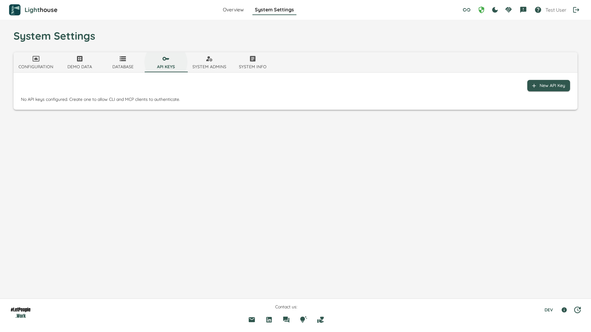
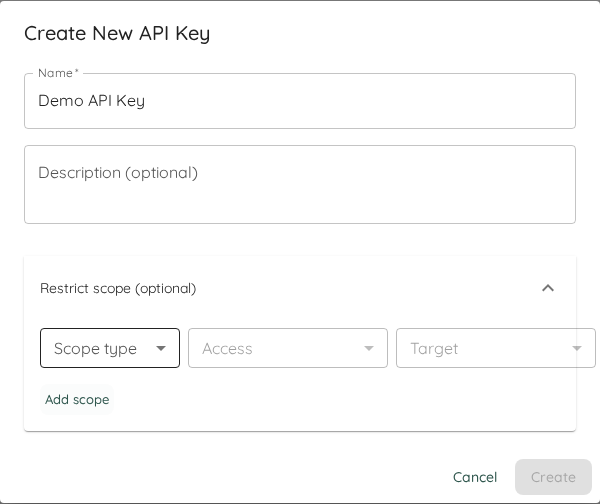

# API Keys

API keys let you authenticate non-browser Lighthouse clients such as the CLI, MCP servers, scripts, and other automation workflows. If you are setting up Lighthouse for AI clients or automation, start with [AI and Automation](../aiintegration.html) and then come back here to create the credential.



## Why API Keys Exist

Browser users sign in through the normal Lighthouse authentication flow. Automated clients are different: they need a stable credential they can send on each request without an interactive login.

Typical use cases include:

- Running `lh` from a terminal or CI pipeline
- Starting `@letpeoplework/lighthouse-mcp-stdio` for a local AI client
- Hosting `@letpeoplework/lighthouse-mcp-http` as a shared MCP endpoint
- Writing custom scripts that call Lighthouse programmatically

## Prerequisite: Authentication Must Be Enabled

API keys are only available when Lighthouse authentication is enabled. If authentication is disabled, the API Keys settings page will show an informational message and the **New API Key** action will remain unavailable.

See [Authentication](../Installation/authentication.html) for the full setup.

{: .note}
API keys are intended for non-browser clients. They complement interactive sign-in; they do not replace it.

## Creating a New API Key

1. Open *System Settings*.
2. Go to *API Keys*.
3. Click *New API Key*.
4. Enter a **Name** and, optionally, a **Description**.
5. Optionally expand **Scopes** to restrict the key to specific teams or portfolios. Each scope row picks a scope type (System / Team / Portfolio), a role, and — for team/portfolio scopes — the specific entity.
6. Create the key and copy the generated plaintext value immediately.



{: .important}
The plaintext API key is shown only once, directly after creation. Lighthouse stores only a protected representation of the key. If you lose the value, you must delete the key and create a new one.

## Managing Existing Keys

The API Keys table shows metadata for each configured key:

| Field | Meaning |
| --- | --- |
| Name | Friendly label for the key |
| Description | Optional note about where the key is used |
| Created At | When the key was created |
| Last Used | When the key was most recently used |

When RBAC is enabled, an additional **Scopes** column is shown. Each cell renders the per-key permission rows (role + scope target), or **Unrestricted** for keys that were created without explicit scopes (these inherit the owner's permissions at runtime). When RBAC is disabled, the Scopes column is hidden — per-key scopes have no effect in that configuration.

This makes it easier to distinguish long-running automation keys from test credentials and to spot keys that are no longer in active use.

## Deleting a Key

Keys can be deleted at any time from the *Actions* column.

Deletion is permanent. There is no in-place rotate or reveal action. The normal lifecycle is:

1. Create a new key.
2. Update the consuming script, CLI config, or MCP server.
3. Delete the old key.

## Using the Key

Most Lighthouse automation clients read the key from `LIGHTHOUSE_API_KEY`.

CLI example:

```bash
LIGHTHOUSE_API_KEY=<key> lh team list --json
```

MCP stdio example:

```bash
LIGHTHOUSE_URL=https://lighthouse.example.com \
LIGHTHOUSE_API_KEY=<key> \
npx -y @letpeoplework/lighthouse-mcp-stdio
```

MCP HTTP example:

```bash
LIGHTHOUSE_URL=https://lighthouse.example.com \
LIGHTHOUSE_API_KEY=<key> \
npx -y @letpeoplework/lighthouse-mcp-http
```

For broader setup examples, including Docker and MCP client configuration, see [AI and Automation](../aiintegration.html).