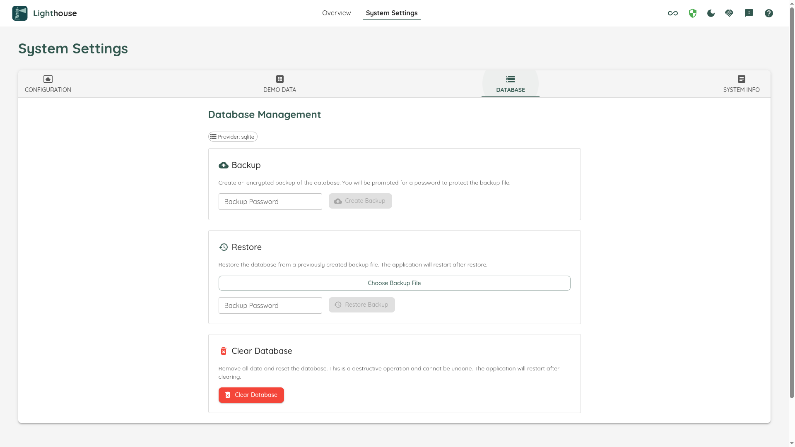

# Database Management

The **Database Management** page (found under *System Settings → Database Management*) lets you back up, restore, and clear the Lighthouse database directly from the UI — no command-line access or manual file system operations required.

## Operations

### Backup

Creates an encrypted snapshot of the current database and downloads it to your machine as a single `.zip` file.

**How to create a backup:**
1. Enter a password in the *Backup password* field.
2. Click **Create Backup**.
3. The file is downloaded automatically with the name `Lighthouse_Backup_<date>.zip`.

**Keep your password safe.** It is required to restore the backup later. Lighthouse does not store it anywhere and there is no recovery mechanism if you lose it.

The backup file is AES-256 encrypted (PBKDF2 key derivation, SHA-256, 100 000 iterations). It contains all database content plus a `manifest.json` with metadata (provider name, creation date, app version).

---

### Restore

Replaces the current database with the contents of a previously created backup file. **All existing data is overwritten.**

**How to restore:**
1. Select the `.zip` backup file using the file picker.
2. Enter the password that was used when the backup was created.
3. Click **Restore**.

All running forecasts and background updates are paused until the restart completes.

If the wrong password is supplied the operation fails immediately with an error — no data is changed.

---

### Clear

Removes all data from the database and resets it to a clean state (empty, but fully initialised). This is equivalent to starting with a fresh installation.

A confirmation dialog is shown before any data is deleted.

{: .warning }
> **This is irreversible.** Create a backup first if you want to be able to recover your data.

---

## Concurrent Operations

Only one database operation can run at a time. If a backup, restore, or clear is already in progress, any new request is rejected immediately. In addition, while a database operation is running, all background work (team updates, forecast refreshes, etc.) is paused to prevent data corruption.

The UI shows a warning banner when operations are blocked.

---

## Supported Providers

| Provider | Backup format | Extra tooling required |
|---|---|---|
| **SQLite** | Raw database files (`.db`, `.db-wal`, `.db-shm`) | None — works out of the box |
| **PostgreSQL** | Custom `pg_dump` archive (`lighthouse.pgdump`) | `pg_dump`, `pg_restore`, and `psql` must be installed |

The active provider is shown on the page. You cannot change the provider from this screen — that is controlled by your Lighthouse configuration.

---

## PostgreSQL: Required Tooling

For PostgreSQL installations, the **postgresql-client** tools (`pg_dump`, `pg_restore`, `psql`) must be available on the machine where Lighthouse is running. Without them, backup and restore operations are disabled.

If the tools are missing, the UI shows a warning with a link to [postgresql.org/download](https://www.postgresql.org/download/) where you can install them.

**Docker users:** The official Lighthouse Docker image already includes `postgresql-client`. No additional steps are required.

**Self-hosted / bare-metal:** Install the `postgresql-client` package appropriate for your operating system. The major version of the client tools does not need to match your PostgreSQL server version exactly, but it is recommended to keep them reasonably aligned.

The exact version detected on the server is displayed on the page next to the provider name when tooling is available.
