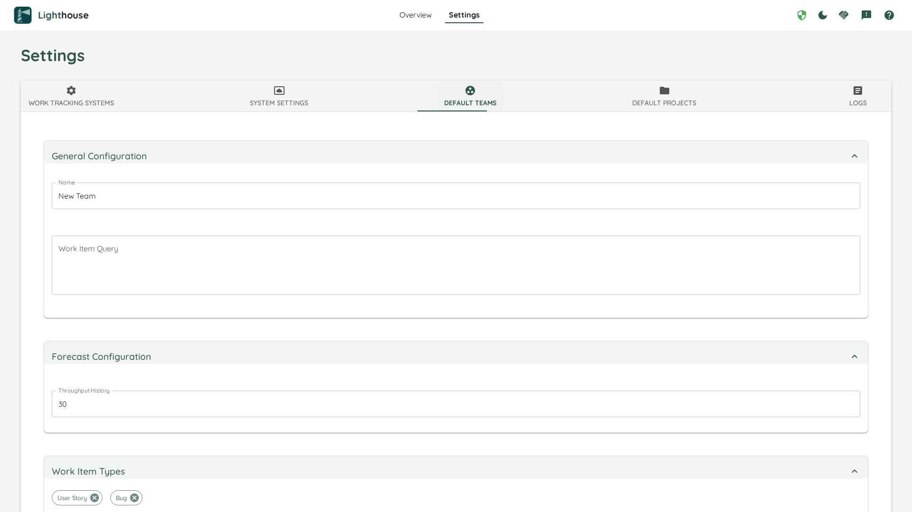

# Default Team Settings
To simplify [Team Creation](../teams/edit.html), you can adjust the default values that are used when you create a new team. While not all settings can be changed, you preconfigure many different settings to make the creation process smoother.

This should help to prevent common mistakes (for example when you configure [States](../teams/edit.html#states) and [Work Item Types](../teams/edit.html#work-item-types)) under the assumption that certain things will look the same for most of your teams.

{: .note}
You can't validate the default settings, as there is not enough information to do that.
You must hit the *Save* button at the bottom of the page for the changes to become effective.

{: .recommendation}
We recommend to create one team, as you can validate all the settings. After this, we suggest to go and adjust the default settings accordingly, to make future team creation more effective.