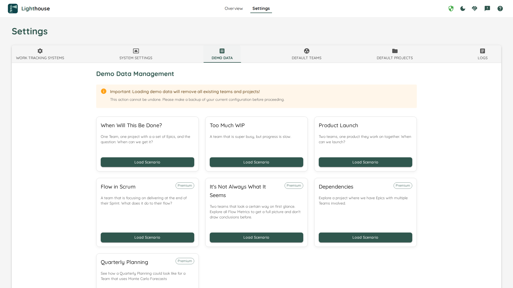

# Demo Data
Whether you just installed Lighthouse and want to see how it works, or you look for specific scenarios for teaching, we've got you covered. Lighthouse offers you to load various sample scenarios with just one click.

{: .important}
Please be aware that loading demo data will remove any existing Projects and Teams.

There are various scenarios, some of them are available in the community edition, while others require you to have a license.

| Scenario Name | Description | Use Cases | Free vs. Premium |
|---------------|-------------|-----------|------------------|
| When Will This Be Done? | One team with a decent throughput, that works on one projects with a set of epics. | Basic flow metrics and forecasting demonstrations, onboarding new users, showing Monte Carlo principles | Free |
| Too Much WIP | A team that is super busy, but progress is slow. | Teaching WIP limits, demonstrating flow problems, capacity planning discussions | Free |
| Product Launch | Two teams, one product they work on together. When can we launch? | Multi-team coordination, release planning with probabilistic forecasting | Free |
| Flow in Scrum | A team that is focusing on delivering at the end of their Sprint. What does it do to their flow? | Show how it impacts *flow* if we're operating with bigger batches in the name of Scrum (*we're aware that this is a Scrum Antipattern - yet it's sadly how many teams operate*) | Premium |
| It's Not Always What It Seems | Two teams that look a certain way on first glance. Explore all Flow Metrics to get a full picture and don't draw conclusions before. | Advanced analytics training, avoiding metric misinterpretation, comprehensive flow analysis | Premium |
| Dependencies | Explore a project where we have Epics with multiple Teams involved. | Complex project planning, cross-team dependencies, program management | Premium |
| Quarterly Planning | See how a Quarterly Planning could look like for a Team that uses Monte Carlo Forecasts | Strategic planning sessions, OKR setting, long-term forecasting | Premium |
| New Product Initiative | A project with 20 unstarted epics representing a new product in early planning stages | Initial forecasting for new initiatives, capacity planning, backlog prioritization, demonstrating "when will we finish?" forecasts | Premium |

## Feedback
We'd love to hear from you! Reach out to us at [contact@letpeople.work](mailto:contact@letpeople.work) or through our [Slack Channel](https://join.slack.com/t/let-people-work/shared_invite/zt-38df4z4sy-iqJEo6S8kmIgIfsgsV0J1A) if you have feedback on the scenarios or wish something else to be covered or adjusted.

Our goal is to make the scenarios useful so you can show the value of continuous flow and probabilistic forecasting. So please don't hesitate to get back to us!