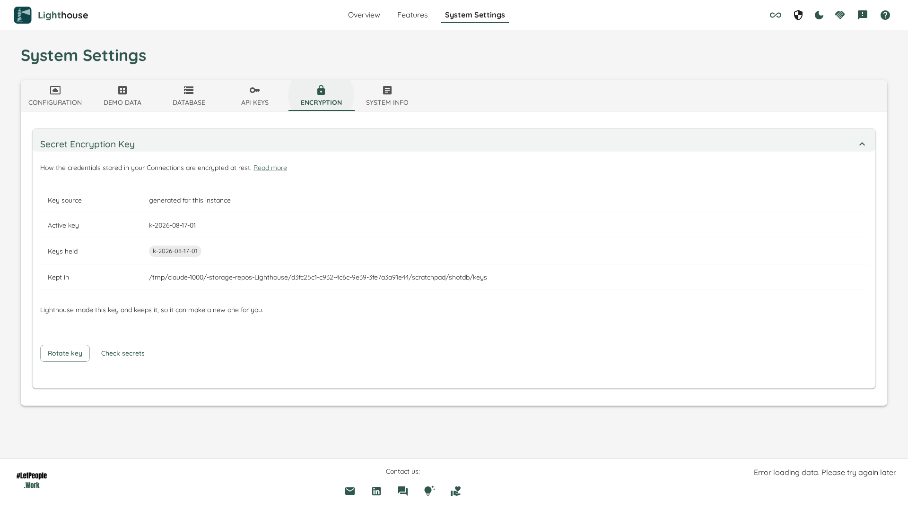

# Secret Encryption Key

To reach Jira, Azure DevOps, ServiceNow and the rest, Lighthouse has to store the credentials you gave it — personal access tokens, client secrets, OAuth tokens. They are encrypted before they are written to the database, and this screen is about the key that encrypts them.

Everything here is System Administrator only.

If you are looking for how to *set* a key rather than what to do with the one you have, that is in [Configuration](../Installation/configuration.html#encryption-key).

## What the screen tells you

**Key source** — who this key belongs to. There are four answers, and they decide what Lighthouse can do for you:

| Key source | What it means |
| --- | --- |
| generated for this instance | Lighthouse made the key on first start and keeps it in a folder next to the database. It can make you a new one. |
| supplied by configuration | You set the key yourself. It belongs to you, and Lighthouse will never replace it. |
| supplied by a mounted secret file | A secret store owns the key and mounts it in. Same as above, kept somewhere else. |
| the key published with the product | This instance has nowhere to keep a key of its own, so it is running on the key that ships inside every copy of Lighthouse. Anyone with a copy can read what it protects. |

**Active key** — the key new secrets are written under, by name. The names are not secret; the key material never appears anywhere in Lighthouse's interface or logs.

**Keys held** — the keys something is actually stored under. A key nothing was ever written under is not listed, even though Lighthouse still holds it and can still read with it. That is why a fresh install shows one key rather than a list including one named after a legacy it never had. Restore a database holding older secrets and the key that wrote them appears again on its own.

**Kept in** — the folder holding the key, and the folder you have to back up alongside the database. It is shown only where Lighthouse keeps the key. Where you supplied it, the screen names the setting instead, because that folder exists and is full of key-shaped files that are *not* your encryption key — backing it up would not take your key with it.

## What you can do

### Check secrets

Reads every stored credential and reports what each one is. It writes nothing, so it is always safe to press.

Every credential comes back in one of four states:

| State | What it means | What to do |
| --- | --- | --- |
| on the key in force | Encrypted under the active key. | Nothing. |
| on an earlier key | Encrypted under a key Lighthouse still holds and can read. | Nothing, or move them so the older key stops being needed. |
| never encrypted | Stored as-is. | Re-enter the credential on that Connection. |
| could not be read | No key Lighthouse holds can open it. | Re-enter the credential. The report names the Connection and the field. |

Only the states that have something in them are shown — a count of zero is not something you have to act on.

### Move stored secrets

Re-encrypts every credential Lighthouse can read under the key currently in force, and leaves alone anything it cannot. **Nobody has to re-enter anything.** It is offered only when it would achieve something: if every credential is already on the key in force, there is nothing to move and no button.

It is also not offered when the key in force *is* the key published with the product — there is nowhere to move anything to. What that instance needs is a key of its own; the sentence under the table says how.

### Rotate key

Makes a new key, puts it in force, and moves the stored credentials onto it. Offered only where Lighthouse owns the key, because an instance whose key you supplied would lose a key it made on the very next start — yours wins the resolution again — and every secret written under the new one would be out of reach.

Where you own the key, replacing it is yours to do: put the new key first in your setting, restart, and then press **Move stored secrets**. The screen spells out the exact grammar for your instance.

## After an upgrade

Every Lighthouse before this release encrypted with a key that ships inside the product and can be read out of the public source. If this instance still holds credentials under it, the screen says so without being asked, and tells you how many. Moving them onto this instance's own key fixes it, and nothing has to be re-entered.

## If Lighthouse will not start

A start that finds it cannot read a single stored credential stops rather than continuing on the wrong key, and the message names the key it came up on and the key your credentials say wrote them. [Configuration](../Installation/configuration.html#what-happens-if-the-key-changes) covers what to do — including the way back in if the key is genuinely gone.
