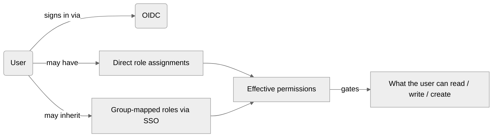

Lighthouse supports **Role-Based Access Control (RBAC)** for fine-grained control over who can read, edit, and create teams and portfolios. RBAC builds on top of [Authentication](../Installation/authentication.html) and is configured under **Settings → Access**.

{: .note}
RBAC is a **Premium** feature. A valid Premium license is required, and [OIDC authentication](../Installation/authentication.html) must be enabled first.

- TOC
{:toc}

---

## Overview

By default — with authentication enabled but RBAC not yet bootstrapped — every signed-in user has full access. RBAC narrows that down: each user holds one or more **role assignments**, and each role grants a specific set of capabilities scoped to a specific entity (the whole system, a single team, or a single portfolio).



A user's **effective permissions** are the merged set of their direct assignments and any roles inherited from SSO group memberships. When the two overlap, the higher role wins.

---

## Roles

Lighthouse defines four roles. Each role is scoped:

| Role | Scope | What it grants |
|---|---|---|
| **System Admin** | System-wide | Full read / write / delete on every team and portfolio, plus management of users, group mappings, and system settings. |
| **Team Admin** | A specific team | Read and write the team's settings, throughput, features, and metrics; delete the team. Can also create new teams and new portfolios (see [Creation Rights](#creation-rights-for-teams-and-portfolios)). |
| **Portfolio Admin** | A specific portfolio | Read and write the portfolio's features, settings, and metrics; delete the portfolio. Can also create new portfolios and new teams (see [Creation Rights](#creation-rights-for-teams-and-portfolios)). |
| **Viewer** | A specific team **or** a specific portfolio | Read-only access to the assigned entity. Cannot edit, delete, or create. |

A single user can hold multiple role assignments — for example, *Team Admin on Team Alpha*, *Viewer on Portfolio Vision*, and *Portfolio Admin on Portfolio Horizon* at the same time.

{: .important}
The System Admin role is the only role that is **not** scoped to a specific team or portfolio. Every other role is bound to exactly one entity.

---

## Bootstrap: becoming the first System Admin

When RBAC is enabled for the first time on a fresh database, **no System Admin exists yet**. Lighthouse handles this with a one-time bootstrap flow:

1. Sign in to Lighthouse as the user you want to become the first System Admin.
2. Go to **Settings → Access**.
3. A yellow banner shows **You have not been granted a System Admin role yet**. Click **Become First System Admin**.
4. You are now the first System Admin. The banner disappears and the Users / Group Mappings tables become editable.

{: .note}
Until the first System Admin is bootstrapped, **every authenticated user** is treated as a System Admin by Lighthouse. This is the only way the very first sign-in can configure access. Once the bootstrap is complete, the unconditional access goes away — only the bootstrapped user (and any users they explicitly grant access to) retains administrative rights.

---

## Emergency Admin

Lighthouse provides a configuration-driven safety net so you cannot accidentally lock yourself out. Users listed under `Authentication.EmergencySystemAdminSubjects` in `appsettings.json` always retain System Admin access, even if their database role is removed.

```json
{
  "Authentication": {
    "Enabled": true,
    "EmergencySystemAdminSubjects": [
      "auth0|emergency-admin-1",
      "azure|2f5e8a47-..."
    ]
  }
}
```

The subject value must match the `sub` claim issued by your identity provider for that user.

{: .recommendation}
Keep at least one Emergency Admin entry for your production environments. The Access tab marks these users with an **Emergency Admin** badge and prevents their System Admin role from being revoked through the UI.

---

## Granting roles to users

Once you are a System Admin, you can grant roles from **Settings → Access → Users**:

1. Sign-in events automatically create a user row the first time someone authenticates. If a user has not signed in yet, ask them to sign in once so their row appears.
2. Click the **Edit** icon next to the user's row.
3. Choose a role and (for Team Admin / Portfolio Admin / Viewer) the team or portfolio to scope it to.
4. Click **Save**.

To revoke access, click the **Trash** icon. Removing the last role assignment for a user takes their permissions back to nothing — they will still be able to sign in, but Lighthouse will not show them any teams or portfolios.

{: .note}
You cannot revoke your own System Admin role if you are the only System Admin remaining. Lighthouse keeps at least one System Admin at all times.

---

## SSO group mappings

If your identity provider issues group claims, you can grant roles to entire groups instead of one user at a time. Group-derived roles behave **exactly** like direct grants — they merge into the user's effective permissions on every request.

1. Go to **Settings → Access → Group Mappings**.
2. Click **Add Group Mapping**.
3. Enter the **Group value** as it appears in the user's token claims (case-sensitive — copy/paste from your IdP).
4. Choose the **Role** and the scope (System / a specific team / a specific portfolio).
5. Click **Save**.

The next time a user from that group signs in (or refreshes their session), they will automatically have the mapped role. No database row is created — the role is computed from the claim on every request.

{: .important}
The group claim name Lighthouse reads is the IdP-configured claim that lists group memberships. For most providers this is `groups`, but Keycloak, Entra ID, and Auth0 may require a mapper / claim configuration step in the IdP to actually include the groups in the token. See your IdP's documentation if Lighthouse does not recognise a user's group membership.

---

## Creation Rights for Teams and Portfolios

Creating a new team or portfolio requires an administrative role somewhere in the system. The rules:

| You can create… | If you hold ANY of these | Additional prerequisite |
|---|---|---|
| A new team | System Admin · Team Admin (any team) · Portfolio Admin (any portfolio) | — |
| A new portfolio | System Admin · Team Admin (any team) · Portfolio Admin (any portfolio) | At least **one team** must exist in the system. |

A few practical consequences:

- **Holding *any* administrative role lets you create both teams and portfolios.** A Team Admin on Team Alpha can still create a brand-new portfolio. A Portfolio Admin on Portfolio Vision can still create a brand-new team.
- **The team-existence rule applies to everyone — including System Admin.** A portfolio without any team to roll up is structurally meaningless, so Lighthouse hides the **Add Portfolio** button until at least one team exists anywhere in the system.
- **Visibility is decoupled from the gate.** The check is "*does a team exist anywhere?*" not "*does this user have read access to a team?*". If three teams exist in the system and you only have visibility into one of them, you can still create a portfolio that contributes to the other two — you just won't be able to see those teams' details.
- **Creators are auto-promoted on what they create.** A successful Create Team grants the creator **Team Admin** on the new team. A successful Create Portfolio grants the creator **Portfolio Admin** on the new portfolio. Existing roles on other entities are preserved.
- **Viewers cannot create anything.** A user who holds only Viewer roles never sees the Add buttons.

### What the Add buttons look like

| State | Add Team button | Add Portfolio button |
|---|---|---|
| Authenticated user with no admin role | Hidden | Hidden |
| Holds any admin role · 0 teams exist in the system | Visible | Hidden |
| Holds any admin role · ≥1 team exists in the system | Visible | Visible |
| Bootstrap mode (no System Admin configured yet) · 0 teams | Visible | Hidden |
| RBAC disabled · 0 teams | Visible | Hidden |

---

## API Keys interplay

[API Keys](./apikeys.html) are an alternative authentication path for non-browser clients (CLI, MCP servers). When RBAC is enabled, an API key inherits the role assignments of the user who created it. Treat API keys as a credential for that user — they can do exactly what the owning user can do, no more and no less.

To restrict what an API key can reach, scope the **owner's** roles rather than the key. Lighthouse does not currently support per-key role narrowing.

---

## Common Tasks

### Grant Team Admin to a specific user

1. Ask the user to sign in once (so their row appears in the Users table).
2. **Settings → Access → Users → Edit** that user → choose **Team Admin** + the team → **Save**.

### Map an SSO group to Portfolio Admin

1. **Settings → Access → Group Mappings → Add Group Mapping**.
2. Enter the group value (case-sensitive, as it appears in the user's IdP token).
3. Choose **Portfolio Admin** + the portfolio → **Save**.

### Revoke a user's access entirely

1. **Settings → Access → Users**, find the user.
2. Click **Edit** → remove each role → **Save**. The user can still sign in, but Lighthouse will not show them any teams or portfolios.

### Recover access when locked out

1. Add the locked-out user's IdP `sub` claim to `Authentication.EmergencySystemAdminSubjects` in `appsettings.json`.
2. Restart Lighthouse.
3. Sign in as that user — they will now have unconditional System Admin access via the emergency configuration.

---

## Troubleshooting

### The **Add Portfolio** button is missing even though I'm an admin

Portfolios require at least one team to exist anywhere in the system. Create a team first and the button will appear. This applies to every role, including System Admin and the bootstrap-time first user.

### I'm a Team Admin but the **Add Portfolio** button is hidden

Same as above — check whether any team exists. If at least one team exists and the button is still hidden, refresh the page (the authorization summary is fetched on load) or sign out and back in to pick up role changes.

### A user signed in but does not appear in the Users table

The user row is created on first sign-in. If the user is still missing, check the **Logs** in System Info for sign-in errors — most often the OIDC token is missing the configured `sub` claim or the `Authority` URL is unreachable. See [Authentication Troubleshooting](../Installation/authentication.html#troubleshooting).

### A user's SSO group does not seem to grant the role

Lighthouse only sees groups your identity provider actually includes in the token. The fix is on the IdP side:

- **Keycloak**: add a *Group Membership* mapper to the client scope; ensure **Add to ID token** and **Add to access token** are enabled.
- **Microsoft Entra ID**: under **Token configuration**, add the **groups** optional claim. For large directories, restrict to *Groups assigned to the application* to stay under the token-size limit.
- **Auth0**: add an Action / Rule that copies the user's groups into a custom claim, and configure Lighthouse to read that claim.

Compare the value Lighthouse sees (visible in the browser's token after sign-in, or in the Lighthouse logs at Debug level) with the group value you entered in the mapping — group values are case-sensitive.

### I can no longer revoke a user — the Revoke button is missing

That user is configured as an Emergency Admin in `appsettings.json`. To revoke their access you must remove them from `Authentication.EmergencySystemAdminSubjects` and restart Lighthouse. The badge on their row explains why the button is hidden.

### The bootstrap banner does not appear for the first user

The bootstrap flow only triggers when **no** System Admin exists in the database. If you have already bootstrapped (or restored a database that contains a System Admin), the banner is correctly hidden. To recover, either sign in as that System Admin or use the Emergency Admin path described above.
