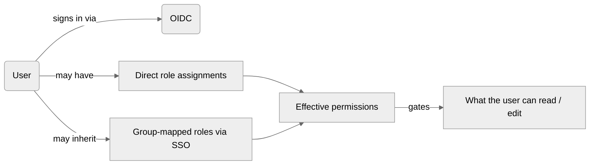

Lighthouse supports **Role-Based Access Control (RBAC)** for fine-grained control over who can read and edit teams and portfolios. RBAC builds on top of [Authentication](../Installation/authentication.html) and is configured under **Settings → Access**.

{: .note}
RBAC is a **Premium** feature. A valid Premium license is required, and [OIDC authentication](../Installation/authentication.html) must be enabled first.

- TOC
{:toc}

---

## Overview

By default — with authentication enabled but RBAC not yet bootstrapped — every signed-in user has full access. RBAC narrows that down: each user holds one or more **role assignments**, and each role grants a specific set of capabilities scoped to a specific entity (the whole system, a single team, or a single portfolio).



A user's **effective permissions** are the merged set of their direct assignments and any roles inherited from SSO group memberships. When the two overlap, the higher role wins.

---

## Roles

Lighthouse defines four roles. Each role is scoped to either the whole system, a single team, or a single portfolio.

| Role | Scope | What it grants |
|---|---|---|
| **System Admin** | System-wide | Full read / edit / delete on every team and portfolio, plus management of users, group mappings, work tracking system connections, and system settings. **Creates new teams and portfolios.** Clones and deletes existing ones. |
| **Team Admin** | A specific team | Read and **edit** the team's settings, throughput, features, and metrics. Cannot create, clone, or delete teams; cannot manage any portfolio. |
| **Portfolio Admin** | A specific portfolio | Read and **edit** the portfolio's features, settings, and metrics. Cannot create, clone, or delete portfolios; cannot manage any team. |
| **Viewer** | A specific team **or** a specific portfolio | Read-only access to the assigned entity. Cannot edit, delete, or create. |

A single user can hold multiple role assignments — for example, *Team Admin on Team Alpha*, *Viewer on Portfolio Vision*, and *Portfolio Admin on Portfolio Horizon* at the same time.

{: .important}
The System Admin role is the only role that is **not** scoped to a specific team or portfolio. Every other role is bound to exactly one entity.

### Capability matrix at a glance

|  | System Admin | Team Admin (scope) | Portfolio Admin (scope) | Viewer (scope) |
|---|---|---|---|---|
| Create a new team | ✅ | ❌ | ❌ | ❌ |
| Create a new portfolio | ✅ † | ❌ | ❌ | ❌ |
| Clone a team / portfolio | ✅ | ❌ | ❌ | ❌ |
| Delete a team / portfolio | ✅ | ❌ | ❌ | ❌ |
| Edit settings on assigned team / portfolio | ✅ | ✅ (own scope) | ✅ (own scope) | ❌ |
| Read assigned team / portfolio (metrics, features, etc.) | ✅ | ✅ (own scope) | ✅ (own scope) | ✅ (own scope) |
| Manage users / group mappings | ✅ | ❌ | ❌ | ❌ |
| Manage work tracking system connections | ✅ | ❌ | ❌ | ❌ |
| List work tracking system connections | ✅ | ✅ | ✅ | ✅ |

† **Portfolio creation also requires at least one team to exist in the system.** This applies even to System Admin: a portfolio without any team to roll up is structurally meaningless, so the **Add Portfolio** button stays hidden until the first team is created.

---

## Prerequisites for creating teams and portfolios

Authorization (System Admin role) is necessary but not sufficient — Lighthouse also enforces functional prerequisites:

| To create… | You must have | You must also have |
|---|---|---|
| A team | System Admin role | At least one **work tracking system connection** (e.g. Jira, Azure DevOps, Linear, CSV) |
| A portfolio | System Admin role | At least one **team** in the system, and at least one work tracking system connection |

The team-existence check is **system-wide**, not visibility-filtered: even if you only have read access to some teams, the gate considers every team in the database. (Under v1 this only matters for the connection-availability case; widening creation rights to scoped admins is a future possibility.)

---

## Bootstrap: becoming the first System Admin

When RBAC is enabled for the first time on a fresh database, **no System Admin exists yet**. Lighthouse handles this with a one-time bootstrap flow:

1. Sign in to Lighthouse as the user you want to become the first System Admin. (Note: license upload is allowed in bootstrap mode — see below.)
2. Go to **Settings → Access**.
3. A yellow banner shows **You have not been granted a System Admin role yet**. Click **Become First System Admin**.
4. You are now the first System Admin. The banner disappears and the Users / Group Mappings tables become editable.

### Bootstrap flow on a fresh install

Greenfield install with auth enabled, in order:

1. Sign in as the first user (any user authorised by your IdP).
2. On the **Premium License Required** screen, upload your Premium license. *(In bootstrap mode — i.e. before any System Admin has been granted — license upload is open to any authenticated user. Once a System Admin exists, only the System Admin or an Emergency Admin can upload / replace the license.)*
3. Sign in as the user you want to become the first System Admin.
4. Go to **Settings → Access → Become First System Admin**.
5. Add at least one **work tracking system connection** (Settings → Configuration, or directly on the Overview).
6. Create your first **team** on the Overview.
7. The **Add Portfolio** button becomes visible once a team exists.

{: .note}
Until the first System Admin is bootstrapped, **every authenticated user** is treated as a System Admin by Lighthouse — they can manage RBAC and upload the license. Once the bootstrap is complete, the unconditional access goes away.

---

## Emergency Admin

Lighthouse provides a configuration-driven safety net so you cannot accidentally lock yourself out. Users listed under `Authentication.EmergencySystemAdminSubjects` in `appsettings.json` always retain System Admin access, even if their database role is removed.

```json
{
  "Authentication": {
    "Enabled": true,
    "EmergencySystemAdminSubjects": [
      "auth0|emergency-admin-1",
      "azure|2f5e8a47-..."
    ]
  }
}
```

The subject value must match the `sub` claim issued by your identity provider for that user.

{: .recommendation}
Keep at least one Emergency Admin entry for your production environments. The Access tab marks these users with an **Emergency Admin** badge and prevents their System Admin role from being revoked through the UI.

{: .important}
For the **license-upload bootstrap path**, the Emergency Admin does NOT count as a "real" System Admin. A fresh install with only an emergency admin configured still counts as bootstrap mode — any authenticated user can upload the license. Once a real System Admin has been bootstrapped through **Become First System Admin**, the bootstrap mode ends and the license endpoint locks down to the System Admin and Emergency Admin only.

---

## Granting roles to users

Once you are a System Admin, you can grant roles from **Settings → Access → Users**:

1. Sign-in events automatically create a user row the first time someone authenticates. If a user has not signed in yet, ask them to sign in once so their row appears.
2. Click the **Edit** icon next to the user's row.
3. Choose a role and (for Team Admin / Portfolio Admin / Viewer) the team or portfolio to scope it to. Role changes apply immediately — there is no separate Save step.

To revoke access, click the **Trash** icon. Removing the last role assignment for a user takes their permissions back to nothing — they will still be able to sign in, but Lighthouse will not show them any teams or portfolios.

{: .note}
You cannot revoke your own System Admin role if you are the only System Admin remaining. Lighthouse keeps at least one System Admin at all times.

---

## SSO group mappings

If your identity provider issues group claims, you can grant roles to entire groups instead of one user at a time. Group-derived roles behave **exactly** like direct grants — they merge into the user's effective permissions on every request.

1. Go to **Settings → Access → Group Mappings**.
2. Click **Add Group Mapping**.
3. Enter the **Group value** as it appears in the user's token claims (case-sensitive — copy/paste from your IdP).
4. Choose the **Role** and the scope (System / a specific team / a specific portfolio).
5. The mapping applies immediately.

The next time a user from that group signs in (or refreshes their session), they will automatically have the mapped role. No database row is created — the role is computed from the claim on every request.

{: .important}
The group claim name Lighthouse reads is the IdP-configured claim that lists group memberships. For most providers this is `groups`, but Keycloak, Entra ID, and Auth0 may require a mapper / claim configuration step in the IdP to actually include the groups in the token. See your IdP's documentation if Lighthouse does not recognise a user's group membership.

---

## What each user sees in the UI

Behaviour of the buttons and row actions on the Overview page:

| State | Add Team / Add Portfolio | Edit / Delete / Clone on a row |
|---|---|---|
| Bootstrap mode (no System Admin configured yet) | Both shown; Add Portfolio hidden until a team exists | Bootstrap user is system-admin-equivalent |
| RBAC disabled | Both shown; Add Portfolio hidden until a team exists | Every action available |
| System Admin | Both shown; Add Portfolio hidden until a team exists | Edit + Clone + Delete on every team and portfolio |
| Team Admin on Team X | Both hidden | Edit on Team X only; no Delete / Clone anywhere |
| Portfolio Admin on Portfolio Y | Both hidden | Edit on Portfolio Y only; no Delete / Clone anywhere |
| Viewer on Team X (or Portfolio Y) | Both hidden | Detail action only on the assigned entity |

---

## API Keys interplay

[API Keys](./apikeys.html) are an alternative authentication path for non-browser clients (CLI, MCP servers). When RBAC is enabled, an API key inherits the role assignments of the user who created it. Treat API keys as a credential for that user — they can do exactly what the owning user can do, no more and no less.

To restrict what an API key can reach, scope the **owner's** roles rather than the key. Lighthouse does not currently support per-key role narrowing.

---

## Common Tasks

### Grant Team Admin to a specific user

1. Ask the user to sign in once (so their row appears in the Users table).
2. **Settings → Access → Users → Edit** that user → choose **Team Admin** + the team. Change applies immediately.

### Map an SSO group to Portfolio Admin

1. **Settings → Access → Group Mappings → Add Group Mapping**.
2. Enter the group value (case-sensitive, as it appears in the user's IdP token).
3. Choose **Portfolio Admin** + the portfolio.

### Revoke a user's access entirely

1. **Settings → Access → Users**, find the user.
2. Click **Edit** → remove each role. The user can still sign in, but Lighthouse will not show them any teams or portfolios.

### Recover access when locked out

1. Add the locked-out user's IdP `sub` claim to `Authentication.EmergencySystemAdminSubjects` in `appsettings.json`.
2. Restart Lighthouse.
3. Sign in as that user — they will now have unconditional System Admin access via the emergency configuration.

---

## Troubleshooting

### The **Add Portfolio** button is missing even though I'm a System Admin

Portfolios require at least one team to exist anywhere in the system. Create a team first and the button will appear. This applies even to System Admin and during first-time bootstrap.

### I'm a Team Admin and can't see Add Team / Add Portfolio

Under v1 of RBAC, only System Admin can create teams or portfolios. Team Admin and Portfolio Admin can edit their assigned scope but not create new entities. Ask your System Admin to create the team or portfolio and grant you the corresponding role.

### A user signed in but does not appear in the Users table

The user row is created on first sign-in. If the user is still missing, check the **Logs** in System Info for sign-in errors — most often the OIDC token is missing the configured `sub` claim or the `Authority` URL is unreachable. See [Authentication Troubleshooting](../Installation/authentication.html#troubleshooting).

### A user's SSO group does not seem to grant the role

Lighthouse only sees groups your identity provider actually includes in the token. The fix is on the IdP side:

- **Keycloak**: add a *Group Membership* mapper to the client scope; ensure **Add to ID token** and **Add to access token** are enabled.
- **Microsoft Entra ID**: under **Token configuration**, add the **groups** optional claim. For large directories, restrict to *Groups assigned to the application* to stay under the token-size limit.
- **Auth0**: add an Action / Rule that copies the user's groups into a custom claim, and configure Lighthouse to read that claim.

Compare the value Lighthouse sees (visible in the browser's token after sign-in, or in the Lighthouse logs at Debug level) with the group value you entered in the mapping — group values are case-sensitive.

### I can no longer revoke a user — the Revoke button is missing

That user is configured as an Emergency Admin in `appsettings.json`. To revoke their access you must remove them from `Authentication.EmergencySystemAdminSubjects` and restart Lighthouse. The badge on their row explains why the button is hidden.

### A team or portfolio admin sees the team/portfolio but the Edit settings tab won't load

Earlier versions of Lighthouse gated the work-tracking-system-connection list to System Admin only, which broke the Edit Settings tab for scoped admins. As of vNext this is fixed — Team Admin and Portfolio Admin can read the connection list (with secret values redacted at the DTO layer). Editing connection details still requires System Admin.

### The bootstrap banner does not appear for the first user

The bootstrap flow only triggers when **no** System Admin exists in the database. If you have already bootstrapped (or restored a database that contains a System Admin), the banner is correctly hidden. To recover, either sign in as that System Admin or use the Emergency Admin path described above.

### I uploaded the license but it says "License could not be loaded"

Verify the license file is a JSON file produced by Lighthouse's licensing service and that the system clock is correct (the license has both a `validFrom` and `expiryDate`). On a fresh install (no System Admin bootstrapped yet), any authenticated user can upload — but the file itself must be valid.
