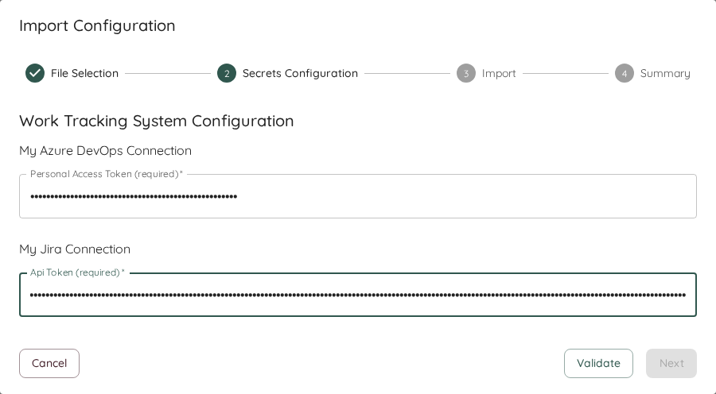
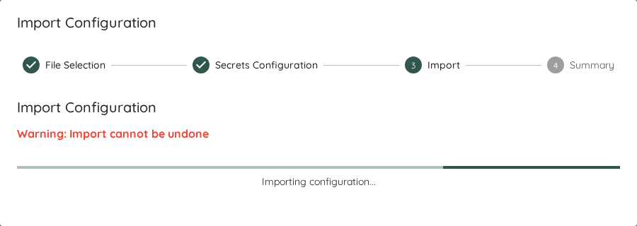
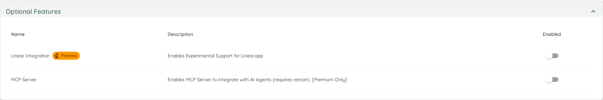

Lighthouse has various options to fine-tune it based on your needs. This page lists what can be configured via the Lighthouse settings page:

- TOC
{:toc}

# Work Tracking Systems
While you can add new Work Tracking Systems via the [Teams](../teams/edit.html#work-tracking-system) and [Project Creation Pages](../projects/edit.html#work-tracking-system), you can manage all Work Tracking Systems via the settings.

## Adding New Work Tracking Systems
You can set up new Connections via the *Add Connection* button, and have to provide the details according to the selected Work Tracking System Type.
See [the concepts](../concepts/concepts.html#work-tracking-system) for more details and how to specify it for your specific system.

## Modifying Existing Systems
It may happen that you want to adjust your existing connections. For example if the URL changes, you want to adjust your connection details (due to an updated token), or simply want to rename it.
You can do so by clicking on the 🖊️ icon on the right side of the work tracking system, and then adjust your settings as needed.

{: .important}
As the secret information (like API Tokens) are not available to the end user, you will **always** have to provide this information again on any change.

## Deleting Systems
You can also delete Work Tracking Systems if they are not needed anymore. To do so, you can click on the 🗑️ icon on the right side of the work tracking system. This will permantenly delete this work tracking system.

{: .note}
You can only delete a Work Tracking System if no team and project is using this. Either remove those teams and projects, or change them to use a different work tracking system.

## Work Tracking System Settings
There are settings that apply to any configured Work Tracking System setting. These you can find below the available and configured systems. Those settings are *advanced* settings, and in general, you ideally never need to adjust them. However, there are situations where this may be coming in handy.

### Request Timeout
You can override the default timeout for the requests that are made to your Work Tracking System. If you do so, it means that it Lighthouse will wait potentially longer for an answer from your system.

This can be useful if you're using a query that returns many items, and your system is not very fast in responding. This is more likely to happen if you're using an internally hosted system (for example Jira Data Center) which may not run on the fastest hardware.

To override, simply toggle on the override button, and specify the desired timeout in seconds. The default timeout when no override is active is 100 seconds. So if you override, you most likely want to be above that.

# System Settings
The System Settings Page shows some generally applicable settings that affect the overall Lighthouse behaviour.

## Lighthouse Configuration
This section allows you to export your configuration to a file, as well as import it back into your Lighthouse instance.

{: .recommendation}
The Export and Import of the Lighthouse Configuration is only available if you have a valid [premium license](../licensing/licensing.html).

### Export
The export can be useful for various reasons:
- As a backup of your configuration
- To share a configuration with colleagues

When you click export, Lighthouse will create a *.json* file that includes the full configuration of your Lighthouse instance. The configuration includes:
- Work Tracking Systems
- Teams
- Projects

The export does *not* include any data (work items, features, metrics, etc.) for any team or project. It's just the settings itself. If you fetch the data from your work tracking system, you should then see the same information.

As the config is stored as a file, you can easily share it, as well as store it in a version control system.

{: .important}
The exported file does **not** include any secrets. Your work tracking systems api keys will not be exported. They will have to be entered on import.

### Import

#### File Selection
To start the import, you got to select a *.json* file. Lighthouse will then guide you through the configuration.

As a first step, Lighthouse will check if the file is valid. If it can't read it for whatever reason, it will not allow an import and display an error message.

If it can be read, it will check whether the the Work Tracking Systems, Teams, and Projects are new or exist already. An update of an existing item will mean that the data is kept, and the settings like *work item query*, *states configuration*, etc. will be updated.

{: .note}
The detection whether something exists already is done via checking the name. The name has to match exactly.

You can also chose to *Clear* the existing configuration. This means, all Work Tracking Systems, Teams, and Projects that you may have configured will be removed as part of the import process.

#### Secrets Configuration
If a new work tracking system is added, you'll have to specify all options that are secret on import (for example API Tokens). This makes sure that, while we can share the configuration, you will not share access tokens and reuse the token from another person.

#### Import
Once you've validated the secrets, you can start the import. Please note that this might take a while, depending on the size of your configuration.

{: .important}
Once you have started the import, you can't undo the changes!

#### Import Summary
After you've imported, you'll see a summary and potential errors or problems. For every imported item, a validation is run to check whether it worked. If the validation failed, it means the import worked but some setting may need to be adjusted.

At the end, you can choose whether you want to update all imported Teams and Projects or just close the dialog. If you decide to not update, you will not have any data for some time, until the period update kicks in. This may be desired if you want to double check the settings first (for example in case of validation errors).

## Optional Features
Some features might not make sense to be enabled in all situations. And occasionally some new features will be deployed with the latest version of Lighthouse that we deem not ready for general use. In such a case you would find a toggle in the *Optional Features* setting which you can selectively enable or disable.

Eventually, the Features in preview will be integrated into the regular functionality, and the preview flag will be removed. In rare cases, a preview feature might get removed.

{: .recommendation}
While preview features should be relatively stable, it can be that they will not work perfectly yet. If you enable them and encounter issues, please let us know about it. We're looking forward to your feedback!

## Terminology Configuration
Lighthouse allows you to customize the terminology used throughout the application to better align with your organization's language and workflow conventions. This feature helps eliminate confusion by ensuring consistent terminology that matches how your team and organization refers to work items and concepts.

*** End Patch
