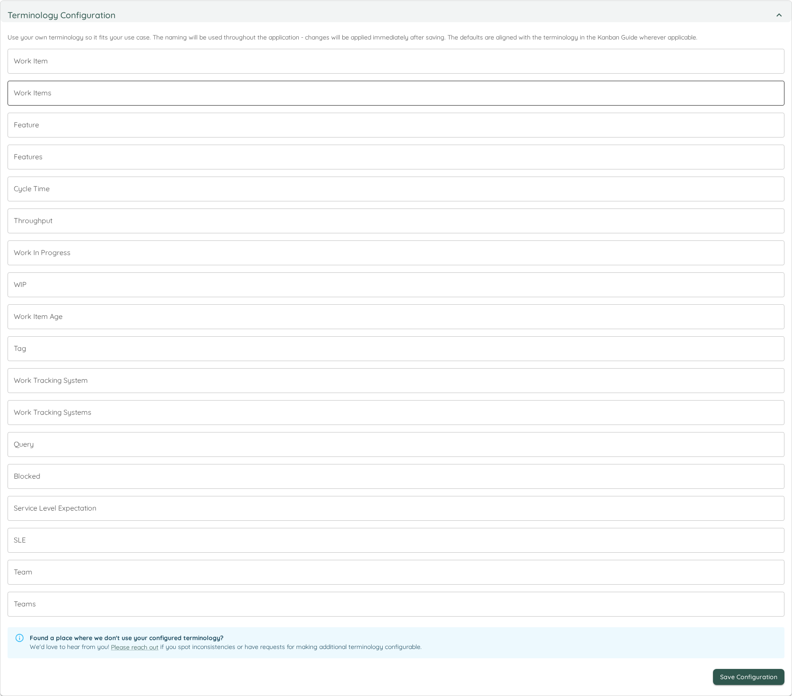
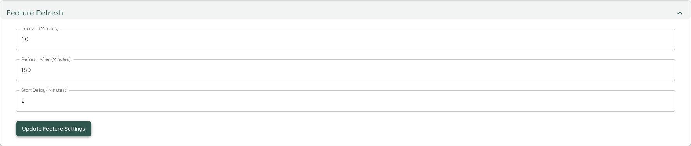

# System Settings
The System Settings Page shows some generally applicable settings that affect the overall Lighthouse behaviour.

## Lighthouse Configuration
This section allows you to export your configuration to a file, as well as import it back into your Lighthouse instance.

{: .recommendation}
The Export and Import of the Lighthouse Configuration is only available if you have a valid [premium license](../../licensing/licensing.html).

### Export
The export can be useful for various reasons:
- As a backup of your configuration
- To share a configuration with colleagues

When you click export, Lighthouse will create a *.json* file that includes the full configuration of your Lighthouse instance. The configuration includes:
- Work Tracking Systems
- Teams
- Projects

The export does *not* include any data (work items, features, metrics, etc.) for any team or project. It's just the settings itself. If you fetch the data from your work tracking system, you should then see the same information.

As the config is stored as a file, you can easily share it, as well as store it in a version control system.

{: .important}
The exported file does **not** include any secrets. Your work tracking systems api keys will not be exported. They will have to be entered on import.

### Import

#### File Selection
To start the import, you got to select a *.json* file. Lighthouse will then guide you through the configuration.

As a first step, Lighthouse will check if the file is valid. If it can't read it for whatever reason, it will not allow an import and display an error message.

If it can be read, it will check whether the the Work Tracking Systems, Teams, and Projects are new or exist already. An update of an existing item will mean that the data is kept, and the settings like *work item query*, *states configuration*, etc. will be updated.

{: .note}
The detection whether something exists already is done via checking the name. The name has to match exactly.

You can also chose to *Clear* the existing configuration. This means, all Work Tracking Systems, Teams, and Projects that you may have configured will be removed as part of the import process.

#### Secrets Configuration
If a new work tracking system is added, you'll have to specify all options that are secret on import (for example API Tokens). This makes sure that, while we can share the configuration, you will not share access tokens and reuse the token from another person.

#### Import
Once you've validated the secrets, you can start the import. Please note that this might take a while, depending on the size of your configuration.

{: .important}
Once you have started the import, you can't undo the changes!

#### Import Summary
After you've imported, you'll see a summary and potential errors or problems. For every imported item, a validation is run to check whether it worked. If the validation failed, it means the import worked but some setting may need to be adjusted.

At the end, you can choose whether you want to update all imported Teams and Projects or just close the dialog. If you decide to not update, you will not have any data for some time, until the period update kicks in. This may be desired if you want to double check the settings first (for example in case of validation errors).

## Optional Features
Some features might not make sense to be enabled in all situations. And occasionally some new features will be deployed with the latest version of Lighthouse that we deem not ready for general use. In such a case you would find a toggle in the *Optional Features* setting which you can selectively enable or disable.

Eventually, the Features in preview will be integrated into the regular functionality, and the preview flag will be removed. In rare cases, a preview feature might get removed.

{: .recommendation}
While preview features should be relatively stable, it can be that they will not work perfectly yet. If you enable them and encounter issues, please let us know about it. We're looking forward to your feedback!

## Terminology Configuration
Lighthouse allows you to customize the terminology used throughout the application to better align with your organization's language and workflow conventions. This feature helps eliminate confusion by ensuring consistent terminology that matches how your team and organization refers to work items and concepts.

### Configurable Terms
The terminology configuration allows you to customize the following terms:

| Term Category | Default Value | Description | Example Alternatives |
|---------------|---------------|-------------|---------------------|
| **Work Item** | Work Item | Individual units of work tracked in your system | Story, Task, Issue, Ticket, Item |
| **Work Items** | Work Items | Plural form of work item | Stories, Tasks, Issues, Tickets, Items |
| **Feature** | Feature | Larger units of work that contain multiple work items | Epic, Initiative, Theme, Component |
| **Features** | Features | Plural form of feature | Epics, Initiatives, Themes, Components |
| **Cycle Time** | Cycle Time | Time from when work starts until completion | Lead Time, Flow Time, Delivery Time |
| **Throughput** | Throughput | Number of items completed in a given time period | Velocity, Delivery Rate, Completion Rate |
| **Work in Progress** | Work in Progress | Items currently being worked on | WIP, In Progress, Active Work |
| **WIP** | WIP | Abbreviated form of Work in Progress | IP, Active, Current |
| **Work Item Age** | Work Item Age | How long an item has been in progress | Item Age, Story Age, Task Age |
| **Tag** | Tag | Labels or categories applied to work items | Label, Category, Type, Keyword |
| **Work Tracking System** | Work Tracking System | The external system that stores your work items | Issue Tracker, Project Management Tool, ALM Tool |
| **Work Tracking Systems** | Work Tracking Systems | Plural form of work tracking system | Issue Trackers, Project Management Tools, ALM Tools |
| **Query** | Query | Search criteria used to find work items | Search, Filter, JQL, WIQL |
| **Blocked** | Blocked | Items that cannot progress due to impediments | Impediment, Stuck, On Hold, Waiting |
| **Service Level Expectation** | Service Level Expectation | Expected time for work completion | SLE, Target Time, Goal, Commitment |
| **SLE** | SLE | Abbreviated form of Service Level Expectation | Target, Goal, Expectation |
| **Team** | Team | Groups of people working together | Squad, Crew, Group, Department |
| **Teams** | Teams | Plural form of team | Squads, Crews, Groups, Departments |

### How to Configure
1. Navigate to *Settings* → *System Settings*
2. Locate the *Terminology Configuration* section
3. For each term you want to customize:
   - View the current default value and description
   - Enter your preferred terminology in the input field
   - Leave blank to use the default value
4. Click *Save* to apply your changes

### Benefits of Customization
- **Consistency**: Eliminates confusion from mixed terminology throughout the application
- **Familiarity**: Use terms that your team already knows and understands
- **Alignment**: Match existing organizational vocabulary and processes
- **Adoption**: Reduce the learning curve for new users by using familiar language
- **Communication**: Improve clarity when discussing metrics and workflows with stakeholders

### Best Practices
{: .recommendation}
- **Team Alignment**: Involve your team in deciding on terminology to ensure everyone understands and agrees with the chosen terms
- **Organizational Standards**: Align with existing terminology used in your organization's other tools and processes
- **Documentation**: Update any team documentation or training materials to reflect the customized terminology
- **Consistency**: Use the same terms consistently across all teams and projects in your Lighthouse instance

{: .note}
Changes to terminology are applied immediately throughout the entire application interface. All existing data and configurations remain unchanged - only the display labels are updated.

## Periodic Refresh Settings
One of the main advantages of Lighthouse is the fact that it's not only offering to run the forecasts on demand, but also **continuously**. To fine-tune this, you can adjust the several settings:

### Refresh Types
There are two types of refreshes:
- Team
- Feature

The Team refresh fetches all items related to your team, and is doing what can manually be done via the [Update Team Data Button](../teams/detail.html#update-team-data), while the Features relate to the different projects and is doing what can be manually trigger via the [Refresh Feature Button](../projects/detail.html#refresh-features).

### Setting Details
Each refresh type contains three different settings. All settings are specified in minutes. After adjusting the setting, the *Update Settings* button must be pressed for the changes to become effective.

| Name | Description |
|------|-------------|
| Interval (Minutes) | The time between checks if the data should be updated. This means, after *x minutes* Lighthouse will check if the last update was older than what was defined in *Refresh After*. |
| Refresh After (Minutes) | The time after which a refresh will be triggered if the last one was more than this time ago. |
| Start Delay (Minutes) | The delay before the background task is started when the application starts. This can be useful as you may not want to trigger updates just after startup. |