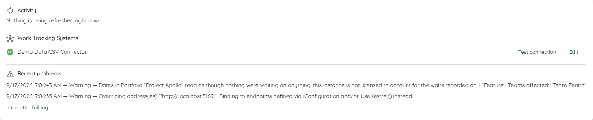

# Task Manager
Lighthouse refreshes your data in the background. The Task Manager is where you can see that happening: what is being refreshed right now, whether every connection to your Work Tracking Systems still works, and what has gone wrong recently.

You reach it from the timeline icon in the header, on the right-hand side between the *Update All* button and the license icon.

{: .note}
The Task Manager is only shown to a **System Administrator**. It names every Team, Portfolio and connection on the instance, so nobody else sees the icon at all. See [Role-Based Access Control](rbac.html) for the roles.

- TOC
{:toc}

# The icon in the header
The badge on the icon counts two things together: the pieces of work in flight, and the connections that are currently broken. No badge means nothing is running and nothing is broken.

The colour is the worst thing there is to say about your connections:

| Colour | Meaning |
|--------|---------|
| The usual brand green | Nothing is wrong with any connection. The badge, if there is one, is only counting work in flight. |
| Orange | At least one connection is *Unreachable*. |
| Red | At least one connection refused Lighthouse's credentials. A credential you can go and fix outranks a system that happened to be down. |

Hovering the icon names the broken connection, so you can tell *which* one needs attention without opening anything.

# Activity
The *Activity* section lists the refreshes this instance has admitted — for Teams and for Portfolios — plus any removal of a Team or Portfolio that is still being processed. If nothing is in flight, it says so.

Lighthouse runs **one** of these at a time. The list is ordered the way the queue will reach them: whatever is running first, then the longest-waiting.

| The row says | It means |
|--------------|----------|
| `Running` | The refresh is talking to your Work Tracking System right now. |
| `Queued` | It has been admitted and is waiting for the lane to free up. |
| `Queued behind <name>` | The same, and this is what it is waiting for. |
| `Stopping…` | You asked it to stop, and Lighthouse has not yet confirmed it has. |

A spinner marks the one piece of work that is actually running; anything waiting gets an hourglass instead.

## Stopping a refresh
Each row has a ✖️ button that stops that refresh.

Work that has not started yet leaves the list immediately — there is nothing to wind down.

Work that is already running takes a moment. Lighthouse cannot interrupt a request that is already on its way to your Work Tracking System; it stops at the connector's next checkpoint, which against a real system has been measured at around ten seconds. The row reads `Stopping…` for that window and then disappears.

{: .note}
A removal cannot be stopped. Asking to stop one is refused and the row carries on — whoever asked for the removal is waiting on an answer, and a half-removed Team or Portfolio is not a state worth leaving behind.

Nothing is lost by stopping a refresh. The data Lighthouse already had stays as it was, and the next periodic refresh picks the Team or Portfolio up again. How often that happens is set under [Periodic Refresh Settings](configuration.html#periodic-refresh-settings).

# Work Tracking Systems
This section lists every connection you have configured, with what Lighthouse currently knows about its health. Its heading follows your own [terminology](configuration.html#terminology-configuration), as do the words for Team and Portfolio in the rows above it.

| Shown as | State | Meaning |
|----------|-------|---------|
| ✅ Green tick | Healthy | Lighthouse reached the system and it accepted the credentials. |
| ⭕ Grey outline | Not checked yet | Nobody has asked. This is **not** a verdict — it is the absence of one. |
| ❌ Red | Unreachable | Lighthouse could not reach the system at all. Usually a URL, a network or an outage. |
| ❌ Red | Authentication failed | Lighthouse reached the system and the credentials were refused. Usually an expired token or a revoked grant. |

When a connection is broken, the row carries a second line saying what went wrong. That line is the difference between reissuing the right credential and the wrong one, so it is shown rather than hidden in a tooltip.

Two buttons sit on each row:

- **Test connection** asks the system right now and updates the state in place. Use it after fixing a credential — you do not have to wait for the next refresh to find out whether it worked.
- **Edit** takes you to that connection, where you can correct the URL or re-enter the token. See [Work Tracking Systems](worktrackingsystems.html).

## How Lighthouse keeps this up to date
Every successful refresh records the connection it used as healthy, so a connection something refreshes regularly stays current at no extra cost.

A connection that nothing refreshes — one you configured but have not attached to a Team or Portfolio yet — would otherwise sit at *Not checked yet* forever. Lighthouse therefore checks connections whose answer is missing or has gone stale, and leaves the rest alone.

An answer is considered stale after **twice the longer of your two refresh intervals**, and Lighthouse looks for stale ones about four times within that window. Both numbers follow the intervals under [Periodic Refresh Settings](configuration.html#periodic-refresh-settings) — there is nothing to configure here, and shortening your refresh intervals tightens this automatically.

{: .note}
This costs no extra calls to your Work Tracking System in the normal case. A connection that something refreshes is never stale, so it is never asked twice.

# Recent problems
Everything this instance has logged at **Warning level or worse** since it started — warnings, errors and fatals — newest first, each row carrying the time it was recorded and its own level. It is there so that "something looks wrong" and "here is what went wrong" are not two different trips.

{: .note}
The log level you set under [System Info](systeminfo.html) applies first. Raise it to *Error* and warnings never reach this list, because they are never recorded at all; at *Information* or below you see both.

Lighthouse keeps the most recent 200 of them in memory. That is enough for about five of the busiest days seen on a real instance, and it is reset by a restart. If you need more, or need them from before the last restart, the log file has everything.

{: .note}
The number is configurable if 200 does not suit your instance: `RecentProblems:Capacity` in `appsettings.json`, or the environment variable `RecentProblems__Capacity`. See [Configuration](../Installation/configuration.html) for the ways to pass settings to Lighthouse.

If nothing has gone wrong since the instance started, it says so. **Open the full log** takes you to [System Info](systeminfo.html), where the complete log lives along with the log level setting.

{: .note}
If the section is missing entirely, Lighthouse asked for the problems and got no answer. That is deliberately not shown as "nothing has gone wrong" — an unanswered question is not a clean bill of health.

# While refreshes are running
The screenshot above was taken on an idle instance, which is what you see most of the time. The Task Manager reads the instance as it changes, so rows appear, change state and leave on their own while the popover is open — you do not need to close and reopen it to see progress. Opening it also re-reads your connections, which is how one you added a minute ago in another tab shows up without a reload.
