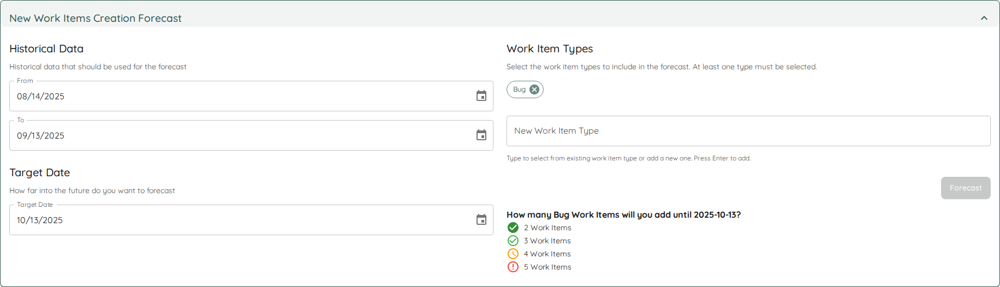

Once you have created your team, you can see all the details on this page. It's split into *Forecasts* and *Metrics*.

In the [Forecasts Tab](#forecasts), you can browse through all the features from the various portfolios the team is involved in, and see how many items are left to do for this team in each feature. Furthermore, you can run manual forecasts.
In the [Metrics Tab](../metrics/metrics.html), you can see various charts for Metrics for this team.

- TOC
{:toc}

{: .note}
You can directly go to the team detail page if you bookmark the specific URL. Even if the team name changes, the URL will stay the same.

# General Team Information and Actions
On top you can see general team information, which includes the Team name, an indication if a [fixed Throughput](./edit.html#throughput-start-and-end-date) is used, and when it was the last time this team was updated.

## Update Team Data
While teams are continuously updated, you can trigger an update manually by clicking on the *Update Team Data* button. This will update all data related to the team, including the forecasts for any portfolio the team is involved in, as well as the Metrics.

A manual update can be useful if you just made significant changes (for example closed a couple of item for this team) and do not want to wait for the periodic update to kick in.

{: .note}
After you trigger the manual update, the button *Update Team Data* will be disabled while the team is updated. Depending on the load of the server and other operations which might be in progress, it can take a while. While every context and team is different, a team data update should normally not take longer than ~60~ seconds. If it does, please reach out to us via Slack, so we can analyze and propose improvements and adjust Lighthouse to be more performant.

## Edit Team
You can modify the team settings by clicking on the *Edit Team* button on the top right. This will bring you to the [Team Modification Page](./edit.html).

# Features
The *Features* section is the default section. If a team is involved in one (or more) portfolios, all the features where this specific team has work for in their backlog are listed.

For every feature, you can see the following details.

## Table Options
The Feature table offers two options that you can toggle on/off:
- Group Features by Parent
- Hide Completed Features

The settings will be stored for this specific team, so next time you won't have to toggle it off/on again.

### Hide Completed Features
If you have many Features that are already completed, you may not want to show all of them. In such a scenario, you can hide the completed features.

## Feature Name
The name of the feature. This is also a clickable link, that points to this specific item in your work tracking system.

Furthermore, there can be two indicators for each feature:
- A ⚠️ emoji symbolizes that this specific feature is using the *Default Feature Size* and is not broken down yet. Check the [Portfolio Modification Page](../portfolios/edit.html#default-feature-size) for details on what that means.
- A ⚙️ emoji symbolizes that there are child items of this specific feature that are currently being **actively** worked on (meaning they are in a [Doing State](./edit.html#states)) by this team.

## Feature Progress
In the progress column, you can see how many items are done and how many are pending for this feature. This is split by the total amount (containing all  items that including the ones from other teams working on the same feature) and items that are specifically relevant for the current team.

{: .note}
If a team is working solo on a feature, both bars will show the same numbers. If not, this means at least one other team is involved in this feature.

## Feature Forecasts
For each Feature you will see the forecasted completion date. You'll get [four different probabilities](../index.html#projected-completion), from *Certain* to *Risky*.

{: .note}
The completion dates of each feature will take into account **all teams** that are involved, not just the one you are currently looking at.

# Forecasts
It shows you all things related to forecasting for this specific team.

## Manual Forecasts
Based on the team's [throughput](#metrics), you can run [Monte Carlo Simulations](../../concepts/montecarlosimulations.html) to answer two important questions for many teams and organizations.

Both questions will be answered with a forecast, which means you'll get multiple results that vary in probability, from certain (95% likelihood) to risky (50% likelihood).

### When
The first question is: When will 'x' items be done? If you have a certain number of items (e.g., remaining for a feature, part of the sprint goal, etc.), you might want to know when you can expect them to be completed.

### How Many
The second question is: How many items will you get done by a certain date? You might have an important customer visit coming up, or simply want to know what is a sensible number of items to plan for in your next sprint.

### Usage
Forecasts done on team-level are *on-demand*, meaning you have to trigger them as needed. Only forecasts for portfolios will be re-run continuously. This is still useful if you want to quickly check something without setting up a full portfolio. Examples could be:
- How much will fit into the next Sprint (for example as preparation for a Sprint Planning)
- When will this Feature most likely be done?
- Will an additional feature fit for a release without having to move a target date?

## New Work Item Predictions
Apart from telling you how many items a team may close, the same forecasting can be applied to the creation of items.

Based on a teams backlog, Lighthouse can predict how many *new items* will enter the backlog.

{: .note}
This forecast is based on the items creation date, independent of their state. So whenever you create a new item, it will be taken into account.

The forecast looks at a given time frame that you can modify by changing the *Start* and *End Date*.
Furthermore you can specify which *Work Item Types* you want to look at, and how far in the future you want to forecast.

This allows you to forecast a scenario like this one:
*Based on the last 90 days, how many new bugs can we expect in the next 30 days?*

The result will be a probabilistic one, where you get the usual percentiles:
- 50% chance you will get 5 or more
- 70% chance you will get 4 or more
- 85% chance you will get 3 or more
- 95% chance you will get 2 or more

That may help you plan for the not plannable, as you can see that, based on your past, you will will have a good chance of 4 bug items making it into your backlog.