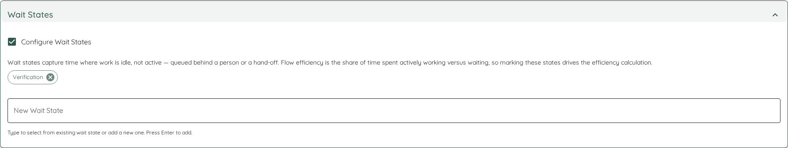
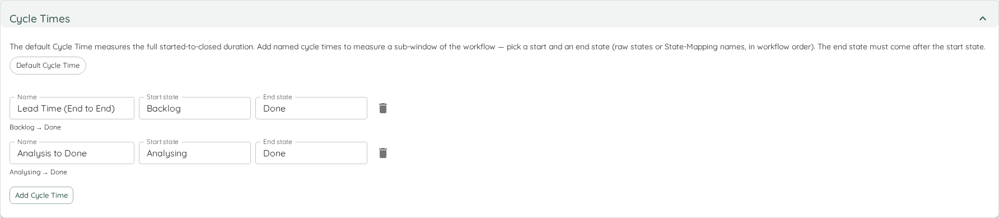

Whether you want to create a new team or edit an existing one, you can use this page to specify all the details that make up your team.

Teams can be created from scratch with default settings, by cloning existing teams, or edited to modify their configuration.

## Creating Teams by Cloning

You can create a new team by cloning an existing team's settings. When you clone a team:

* Navigate to the team overview page and click the "Clone" button next to the team you want to copy
* This opens the team creation page pre-filled with the original team's settings
* The team name is automatically prefixed with "Copy of " followed by the original team's name
* All settings including work item query, work item types, states, throughput configuration, and other team-specific settings are copied
* Only the team settings are copied - portfolio assignments and other relationships are not automatically copied
* You can modify any of the pre-filled settings before saving the new team

Cloning is useful when setting up multiple teams with similar configurations or when you want to create variations of existing team setups.

- TOC
{:toc}

# Validation and Save
Before you can save a new or modified team, you'll have to *Validate* the changes. Lighthouse will run a query against your specified work tracking system and make sure that the query is successfully executing. Only after this you will be able to save.

The validation checks the following things:
- The connection to the work tracking system is valid (the connection settings are ok)
- The query can be executed (the query is having a correct syntax)
- The query returns at least one closed item (we must have a *Throughput* in order to forecast, so we need at least one closed item)

If the validation is ok, you are good to save the changes.

# General Configuration
The general information contains the name of your team. This can be anything that helps you identify it.

{: .recommendation}
We suggest to use the same name as you use in your work tracking system to identify your team.

## Work Tracking System
In order for Lighthouse to get the data it needs for forecasting, it needs to connect to your Work Tracking System. Work Tracking Systems are stored in the Lighthouse Settings and can be reused across Teams and Portfolios.

When creating or modifying both Teams or Portfolios, you can either choose an existing connection or create a new one.

Each connection has a specific name and a type. Depending on the type, different configuration options have to be specified. Check the detailed pages on [Jira](../../concepts/worktrackingsystems/jira.html#work-tracking-system-connection), [Azure DevOps](../../concepts/worktrackingsystems/azuredevops.html#work-tracking-system-connection) or [Csv](../../concepts/worktrackingsystems/csv.html) for details.

## Work Item Query
The Work Item Query is the query that is executed against your [Work Tracking System](../../concepts/concepts.html#work-tracking-system) to get the teams backlog.
The query should fetch all items that "belong" to this team and the specific syntax depends on the Work Tracking System you are using.

See the [Jira](../../concepts/worktrackingsystems/jira.html#team-backlog) and [Azure DevOps](../../concepts/worktrackingsystems/azuredevops.html#team-backlog) specific pages for details on the query.

If you chose a file-based Work Tracking system (like CSV), you will see an upload dialog instead of a query, which will allow you to upload the datasource.

# Forecast Configuration
Throughput is the base of any forecast Lighthouse is making. For every team, you can decide whether you want to use *dynamic* throughput that looks at the last number of days and is every day updating, or one that is using a fixed period of time.

{: .recommendation}
We highly recommending using a dynamic Throughput over a fixed one. The fixed dates might help to overcome special situations *temporarily*. In general, you will get less accurate results with fixed dates, as your teams throughput will change over time, and Lighthouse will not take this into account if the Throughput will be always looking at the exact same period of time.

## Throughput History
This is the number of days of the past you want to include when running forecasts for this team.
In general this should be more than 10 days, and represent a period where this team was somewhat working in a stable fashion.

{: .recommendation}
We recommend using a value between 30 and 90 days. Fewer and it might be too sensitive to outliers. And more than three months is often too far away for being useful.

## Throughput Start and End Date
If you use a *fixed* Throughput, you must specify a start and end date. The end date cannot be in the future, and the start date must be at least 10 days before the selected end date. This is because we must have at least 10 data points to create a decent forecast.

{: .note}
As mentioned above, use a *fixed* Throughput with caution, and ideally only temporarily. Examples where it may be useful is if most of the team is off for some time (for example if the offices are closed for a week or more, like it happens for some companies in the Christmas period). As soon as you have enough data after this period again, we encourage you to switch back to the *dynamic* Throughput.

## Exclude Items for Throughput (Premium)
The *Exclude Items for Throughput* setting lets a team-admin define which work items should NOT count toward forecast throughput, using the same rule editor Lighthouse already uses for rule-based deliveries. This is a [Premium Capability](../licensing/licensing.html#licensed-features).

The intent is to remove "noise" from the Monte Carlo throughput sample so the forecast reflects the kind of work the team will actually deliver against the upcoming feature backlog. Typical exclusions are Bug items, orphan items (work items with no parent), and tag-driven categories like *maintenance* or *spike*.

### How the rule set is defined
The editor offers the following operators:

- `Equals` / `Not Equals` — exact match (case-insensitive).
- `Contains` / `Does Not Contain` — substring match (case-insensitive).
- `Is Empty` / `Is Not Empty` — match when the field is blank (empty string, missing, or null) / not blank. These two operators take no value input — only the field selection is needed.

Fields available:

- `Type`
- `State`
- `Name`
- `Reference ID`
- `Parent Reference ID` (use `Is Empty` to match orphan items)
- `Tags`
- Connector-defined `additionalField.{id}` entries — same set as delivery rules for this team's connection

A rule that **matches** a work item means **exclude this item from forecast throughput**. This is the inverse of how delivery rules work, where a match means "include". The editor labels make the semantics explicit ("Exclude items where…"). An empty rule set means "no filter" — behaviour is identical to teams without the setting configured.

The rule set is constrained to a maximum of 20 conditions, each with a value up to 500 characters and a known field key. Saving with zero conditions explicitly clears the filter; no separate "delete filter" action exists.

### Combining multiple rules — AND or OR
When the rule set has two or more rules, a **Match** toggle appears above the rule list: choose **All (AND)** to require every rule to match, or **Any (OR)** to require at least one. The mode applies to the whole group — you cannot mix AND and OR within a single rule set.

A concrete example: to exclude everything that doesn't directly contribute to feature delivery, configure:

```
Match: Any (OR)
  Type Equals Bug
  Parent Reference ID Is Empty
```

That excludes both Bug-typed items AND orphan items (work items with no parent) from forecast throughput — a useful default for teams whose Monte Carlo history would otherwise be skewed by these two categories.

### Save and reload — making changes take effect
A valid rule edit is **saved automatically** — there is no Save button. Once the change is persisted, the editor shows an *All changes saved* indicator.

The cached throughput is **not** recomputed automatically, because that is an expensive backend operation. After editing the filter, use the one-click **Reload throughput now** action in the editor to recompute throughput against the new rule set. Until you do, forecasts on the team detail page continue to use the previously cached throughput.

### Where the filter applies
- **Feature Forecasts** — always use the filter when one is configured.
- **Team Forecast** (How Many / When) — per-run toggle labeled **"Use filtered Throughput"**, on by default.
- **Backtest** — per-run toggle labeled **"Use filtered Throughput"**, on by default. Toggling clears any prior backtest result and the backtest re-runs automatically against the new setting.
- **Throughput Run Chart**, **Throughput PBC**, and **Predictability Score Details** — per-view toggle labeled **"Use filtered Throughput"**, off by default (raw view is the default; the filtered view is opt-in for these visualisations).

### Quick-settings indicator
When a filter is configured, the **Throughput** icon in the team's quick-settings bar (header) changes to an info colour and its tooltip mentions *"Forecast filter active — some throughput items excluded"*. This signals at a glance that the team has the feature configured, without occupying space on every chart or forecast surface.

### Empty-filter fallback
If the rule set excludes every closed item in the throughput window, the forecast or backtest **falls back to unfiltered throughput** so the result is still usable even when the filter is too aggressive for the current window. The throughput charts behave differently: in their **filtered** view a zero-match window simply shows an empty chart (the user explicitly asked for the filtered view, so no automatic fallback occurs).

### Premium gate and license downgrades
The rule editor and all per-run / per-view toggles are visible only to premium tenants. If a premium tenant downgrades, the persisted rule set remains on the team (no destructive deletion); the backend silently no-ops the filter and the toggles disappear from every surface. Re-upgrading the license restores filtered behaviour without re-configuration.

# Work Item Types

## Cut Off Days
The *Cut Off Days* setting controls how far back in time Lighthouse will look when fetching work items. Work ITems that were closed *before* this date will be ignored. This helps to speed up the update and forecast process.

- Team default: **180 days**
- Enter a value (in days) appropriate for your team — shorter windows emphasize recent behaviour, longer windows smooth variability.

{: .note}
This only applies to items that are considered done. If you have old items in your backlog, they will still appear. 

In order to properly forecast, Lighthouse needs to know which items your team works on that are relevant for the forecast. Thus you can define the item types that should be taken into account for this specific team.

{: .recommendation}
Common examples for item types on team level are "User Story", "Bug", and "Product Backlog Item" for Azure DevOps, and "Story" as well as "Bug" for Jira.

You can remove types by hitting the remove icon, and add new ones by typing them in and hit *Add Work Item Type*.

{: .note}
You have to type the exact type name as it's used in your Work Tracking System. Make sure to use the exact spelling and casing. Spaces (for example in 'User Story') are supported.

# States
In order for Lighthouse to judge whether an item is *done*, *in progress*, or not even started, you must specify which *states* map to which *category*.

| State Category | Description |
|-------|-------------|
| To Do | Items that are in this state are discovered as *pending* for this team. It is important to have all those states mapped as so Lighthouse can discover pending work for features in a portfolio. |
| Doing | Items that are in this state are actively being worked on. Lighthouse will mark features as *In Progress* based on these states. |
| Done | Items that are done contribute to the Throughput. Based on this value forecasts are made. |

You don't have to add every state to one of the categories. For example you might have a *Removed* or *Canceled* state, which is not mapping to any of the categories. You don't have to specify it, then the item will not be existing for Lighthouse (only items that are in any of the mentioned states are discovered by Lighthouse).

{: .recommendation}
For Azure DevOps, the common states are: *New* or *Backlog* (To Do), *Active*, *Resolved*, *Comitted* (Doing), and *Closed* or *Done* (Done).  
For Jira, the common states are: *To Do* (To Do), *In Progress* (Doing), *Done* (Done).

{: .important}
While Azure DevOps can handle if you specify states that don't exist, Jira will not execute a query with a state that is not in its system. That means for Jira you have make sure everything you mention does exist exactly as specified, as otherwise the [Validation](#validation-and-save) will fail.

## State Mappings
State Mappings let you define Lighthouse-friendly state names and map one or more provider states to each name.

This gives you a two-step setup:
1. Define mappings in the **State Mappings** section.
2. Use the mapped names in **To Do**, **Doing**, or **Done**.

### Examples
- Single-state rename: map `Active` to `Implementation`.
- Multi-state grouping: map `In Progress`, `Code Review`, and `QA Review` to `Implementation`.

After mapping, Lighthouse exposes the mapped name as the state value in Lighthouse views and APIs.

### Validation Rules
- Mapping names must be unique.
- A mapping must contain at least one source state.
- A source state can only exist in one mapping.
- Mapping names can be used in To Do / Doing / Done (this is the intended workflow).

### Notes
- Existing configurations without mappings continue to work unchanged.
- Cloning a team copies State Mappings together with the other team settings.
- Updating mappings is treated as a work-item-related change and triggers refresh/invalidation behavior.

# Tags
Tags allow you to add any kind of additional information that may be helpful for you to identify this team. This may be a specific portfolio or initiative, a department, business unit, or tribe, or anything else that somehow might be useful. You can add as many tags as you want. Existing tags will be shown as proposal.

Tags are checked when you use the search functionality.

# Flow Metrics Configuration
Under this section, you'll find all configuration options related to Flow Metrics.

## System WIP Limit
If you want to work with WIP limits, Lighthouse allows you to specify one for the overall system you are working in. This configuration has **no** impact on any forecasting, but it will show up in your metrics section and helps you identify if you are above or below your limit. If set, the limit will show up:
- In the header of a team
- In the Work In Progress Widget as a *Goal*
- In the WIP Run Chart as a horizontal line

Lighthouse is not allowing you to set state specific limits, it will check everything that is in progress, independent of the states (but based on your [state configuration](#states)).

{: .note}
A WIP limit is not just a maximum you should not exceed. It is what we think is our optimum capacity. Meaning that, while we should not exceed it, we should also not be below it, as this means, we're not running at our optimum. While we should take natural variability into account, we should aim to be **at** the limit we set, and neither below nor above.

## Feature WIP
If your team is working on multiple Features at the same time, you want to adjust the Feature WIP to this number. This will impact your forecasts for portfolios, and will lead to different predicted delivery times.

{: .note}
Working on one Feature at a time does not mean only having one item in progress. It means that all items that are in progress belong to the same feature.

As an example, if you work on a single feature at a time, this feature will be done as fast as possible. If you work on two features, the first feature will finish later (as at least some of the teams effort goes to the second feature). In an ideal world, you have a Feature WIP of one. Your reality might look different, and that's ok. Just know that ideally you should strive to be as close as possible to a Feature WIP of one.

### Automatically Adjust Feature WIP
You can set your Feature WIP to anything you like, there does not need to be a correlation to what is actually happening (although obviously it would be good if the number reflects reality...). If you tick this box, Lighthouse will automatically adjust the Feature WIP with every [Team Data Update](./detail.html#update-team-data) to the number of Features that are right now being worked on by this team.

{: .recommendation}
Tick this box if you want to increase transparency. A higher Feature WIP will lead to *late delivery* of many features. Not everyone will like this. It may be a good way to show why we should use focus (and Lighthouse might give you the underlying data for that). Keep fighting the good fight!

## Service Level Expectation
You can enable a Service Level Expectation (SLE) for your teams. If you do, you must define a *probability* and a range in days. You can use this for forecast single item delivery and to communicate with your stakeholders, as well as to inspect your delivery performance.

If you enable the SLE, you will get additional information in the [Metrics View](../metrics/metrics.html).

## Blocked Items
Enable **Configure Blocked Items** to define what "blocked" means for your process. Lighthouse uses a **rule builder** ("Mark work items as blocked where…") — the same rule engine used elsewhere in the product. Add one or more conditions on a field (for example a tag/label, a state, or any other work item field), pick an operator and a value, and combine them with **and** / **or**. An item counts as blocked when the rule matches.

{: .important}
We do not recommend identifying blocked work by *state* alone. Tags/labels work better from a Flow perspective. [More Details here](https://www.prokanban.org/blog/whats-wrong-with-having-a-blocked-column).

### Blocked Staleness Threshold
Optionally enable **Set Blocked Items Staleness Threshold** and set a number of days. This calibrates the [Blocked Over Time](../metrics/widgets.html#blocked-over-time) status indicator: it turns amber once the oldest blocked item ages past 75% of the threshold and red once it reaches the threshold. Without a threshold configured, that widget prompts you to set one.

## Process Behaviour Chart Baseline
Lighthouse can show **Process Behaviour Charts (PBC)** in the Metrics view. To enable them, configure a **baseline start** and **baseline end** date.

{: .important}
If no baseline is set, Lighthouse will **not** show Process Behaviour Charts.

The baseline is used as the reference period to calculate the average and natural process limits and to highlight special-cause signals.

See [Process Behaviour Charts](../metrics/widgets.html#process-behaviour-charts) for examples and screenshots.

## Wait States
Not all *Doing* time is active work. Some states represent waiting — an item queued behind a person, sitting in a review column, or parked pending a hand-off. The **Wait States** setting lets you mark which of your states count as waiting rather than working.



Tick *Configure Wait States* and add the states (or [state mappings](#state-mappings)) that represent idle time. Lighthouse uses this to calculate **Flow Efficiency** — the share of total time work spends actively progressing versus waiting — which surfaces as a dedicated overview tile and as a figure with highlighted wait bars on the [Cumulative Time per State](../metrics/widgets.html#cumulative-time-per-state) chart.

{: .note}
Wait states are purely a *metrics* concept — they describe how to interpret time already spent in your existing states. They do not change forecasting, throughput, or which items are considered in progress.

{: .recommendation}
Start by marking obvious queues such as *Ready for Review*, *Waiting for Test*, or any column whose name implies a hand-off. A low flow efficiency is not a failure — it is a conversation starter about where work waits.

## Cycle Times (Premium)
Alongside the built-in Cycle Time, you can define **named cycle times** — additional start→end measurements over your workflow. A "Lead Time" from *Backlog* to *Done*, or an "Analysis to Done" from your analysis state onwards, can be tracked side by side.



Add a definition with a name, a **start** state and an **end** state (both pick from your configured states or [state mappings](#state-mappings), in workflow order). The end state must come after the start state. Each named cycle time then appears as a choice on the [Cycle Time Scatterplot](../metrics/widgets.html#named-cycle-times-premium) and the [Cumulative Time per State](../metrics/widgets.html#scope-to-a-named-cycle-time-premium) chart.

{: .note}
If you later remove or reorder a state that a definition references, the definition is kept but marked invalid (shown disabled with a hint) until you fix its boundaries — your other definitions and charts are unaffected.

# Estimation
Chose an additional field that represents the estimation (if you have any). Additionally you can define the *unit*, for example Story Points, Ideal Days, T-Shirt Size, or whatever you use. If an estimation is configured, an additional chart will be rendered, that compares the Estimates with the Cycle Time.

The assumption is that your estimate is numerical. However, if you have categorical values (like *T-Shirt Sizes*), you can specify the categories and drag them in order from lowest to highest.

# Advanced Configuration
There are a few options that are optional. This means that they have an impact, but you can save a team without bothering.

## Parent Override Field
By default, Lighthouse uses the native parent-child relationships from your work tracking system to determine which work items belong to which features.

If you need to override this behavior (for example, to group work items under a custom field instead of the native parent link), you can select a **Parent Override Field**. This field must be defined as an Additional Field on your Work Tracking System connection first.

{: .note}
Go to **Settings > Connections** to define Additional Fields, then return here to select the appropriate field for parent override.
